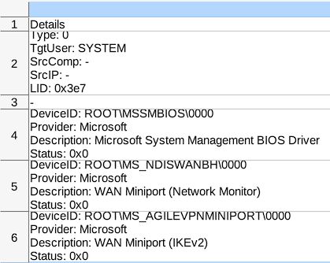

# Analysing Hayabusa Results with LibreOffice

# Table of Contents

- [Analysing Hayabusa Results with LibreOffice](#analysing-hayabusa-results-with-libreoffice)
- [Table of Contents](#table-of-contents)
- [Author](#author)
- [About](#about)
- [Installing LibreOffice](#installing-libreoffice)
- [About the CSV Format](#about-the-csv-format)
- [Creating CSV Results Files](#creating-csv-results-files)
  - [Benefits of Using Details Over AllFieldInfo](#benefits-of-using-details-over-allfieldinfo)
- [Importing the CSV Results File](#importing-the-csv-results-file)

# Author

Zach Mathis ([@yamatosecurity](https://twitter.com/yamatosecurity)) - 2023/03/24

# About

These instructions will also apply to Excel but LibreOffice is used as an example as it is free and can do everything needed for analysis.

# Installing LibreOffice

Install LibreOffice from the [download page](https://www.libreoffice.org/download/download-libreoffice/).

# About the CSV Format

Columns are delimited by commas.
Numbers like the `EventID` and `RecordNumber` and outputted as is.
Just about everything else is considered a string and enclosed in double quotes.
There are often double quotes in the `Details` and `AllFieldInfo` fields so they are escaped by doubling the double quotes.
This allows proper parsing when return characters are used in string fields.
From version 2.3.1, you can use the `-M, --multiline` option to seperate fields in `Details` and `AllFieldInfo` by return characters making that column much more easier to read on normal sized monitors.

# Creating CSV Results Files

In the current 2.x version of Hayabusa, you can save the results in JSON with `hayabusa csv-timeline -d <directory> -o results.csv`.

Hayabusa will use the default `standard` profile and only save the minimal amount of data for analysis in the `Details` column.
If you want to save all of the original field information in the .evtx logs, you can use the `all-field-info` profile with the option `--profile all-field-info`.
If you want to save both the `Details` and `AllFieldInfo` fields just in case, you can use the `super-verbose` profile.

## Benefits of Using Details Over AllFieldInfo

The first benefit of using `Details` over `AllFieldInfo` is that only the important fields are saved, and the field names have been shortened to save file space.
The downside is that there is a possibility of missing data that you actually cared about but was missed.
The second benefit is that Hayabusa will save the fields in a more uniform manner by normalizing the field names.
For example, in original Windows logs, the user name is usually in a `SubjectUserName` or `TargetUserName` field. 
However, sometimes the username will be in an `AccountName` field, sometimes the target user will actually be in the `SubjectUserName` field, etc...
Unfortunately, there a many inconsistant field names in Windows event logs.
Hayabusa tries to normalize these fields, so an analyst only has to parse out a common name instead of having to understand the infinite amount of quirks and discrepancies between event IDs in Windows.

Here is an example of the user field.
Hayabusa will normalize `SubjectUserName`, `TargetUserName`, `AccountName`, etc... in the following manner:
  * `SrcUser` (Source User): when an action happens **from** a user. (Usually a remote user.)
  * `TgtUser` (Target User): when an action happens **to** a user. (For example, a logon **to** a user.)
  * `User`: when an action happens by a currently logged in user. (There is no particular direction in the action.)

Another example are processes.
In the original Windows event logs, the process field is referred to with multiple naming conventions: `ProcessName`, `Image`, `processPath`, `Application`, `WindowsDefenderProcessName`, etc...
Without field normalization, an analyst would have to first be knowledgeable about all of the different field names, then extract out all the logs with these field names, then combine them together. 

An analyst can save a lot of time and trouble by just using the normalized single `Proc` field that Hayabusa provides in the `Details` column.

# Importing the CSV Results File

Open the `.csv` file with LibreOffice and set the import options as follows:

Make sure that the character set is `Unicode (UTF-8)`, only `Comma` is selected as the delimiter and the string delimiter is `"`. 

Results will be shown as below:

Right click on the column header and delete or hide any columns you do not need:

It should now look something like this:

Click the AutoFilter button to filter on the headers:

Freeze the first row and column:

Filter on the different levels in order, select all cells and change the text or background color as you like:

It should now look something like this:

By default, the field information in the `Details` columns are seperated by `¦`.
This makes it difficult to read and often will not fit on a normal screen.

It is recommended to run Hayabusa with the `-M, --multiline` option to replace `¦` with return characters.
When you do this, the field information will be displayed in multiple lines:

The height is not automatically adjusted so select all cells, right click on a row and click `Optimal Height`.

The `Details` column will now look like this:

