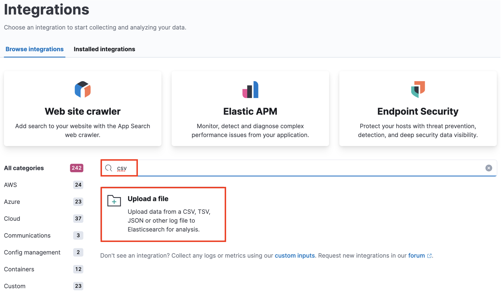
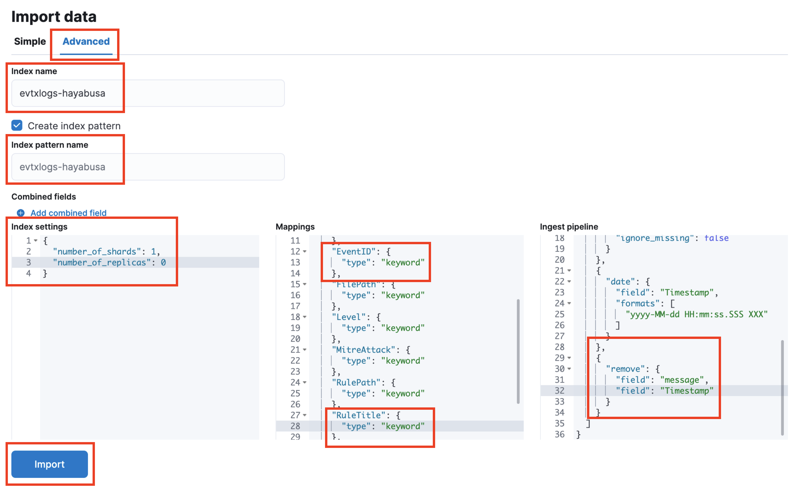
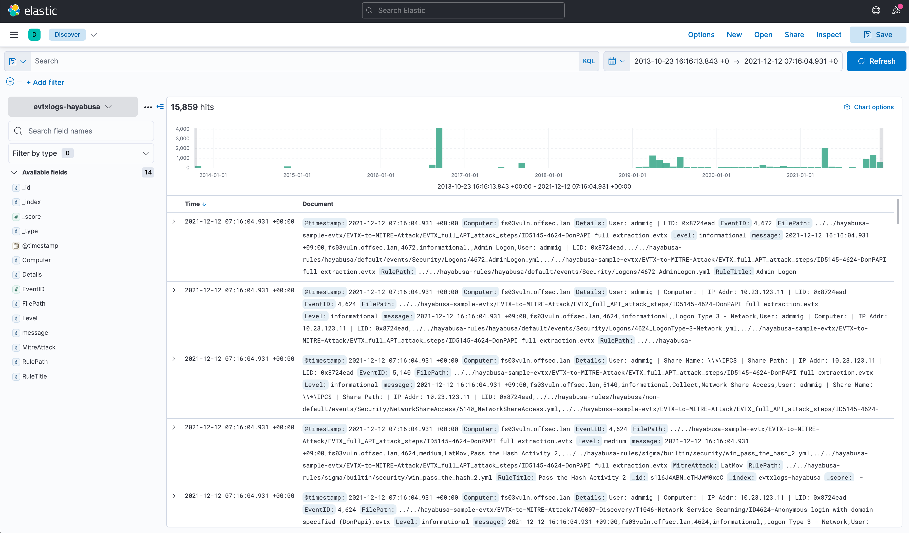
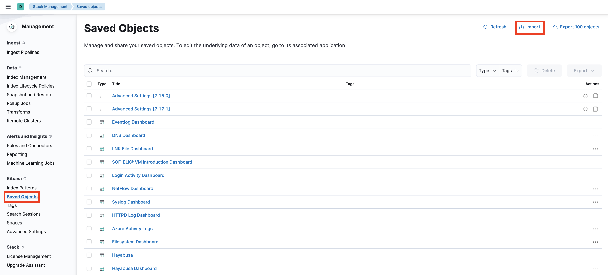

# Elastic Stackへの結果インポート

## Elastic Stackディストリビューションの開始

Hayabusaの結果はElasic Stackへ簡単にインポートすることができます。DFIR調査に特化した無料のElasitc Stack Linuxディストリビューションである[SOF-ELK](https://github.com/philhagen/sof-elk/blob/main/VM_README.md)の仕様をおすすめします。

まず SOF-ELKのVMWareイメージを[http://for572.com/sof-elk-vm](http://for572.com/sof-elk-vm)からダウンロードし解凍します。
ユーザ名とパスワードのデフォルトは以下のとおりです。

* Username: `elk_user`
* Password: `forensics`

VMを起動したら、以下のスクリーンのようなものが表示されます。


表示されたURLをウェブブラウザに入力してKibanaを開きます。例: http://172.16.62.130:5601/

>> Note: Kibanaの読み込みには時間を要します

以下のウェブページが表示されます。


## CSV結果のインポート

一番上の左隅のサイドバーアイコンをクリックし、`Integrations`を開いてください。


サーチバーに`csv`を入力して`Upload a file`をクリックしてください。



CSVファイルをアップロードした後、`Override settings`をクリックして正しいタイムスタンプのフォーマットを指定します。


以下の通り、変更したら`Apply`をクリックします。

1. `Timestamp format` を `custom`に変更する。
2. フォーマットを`yyyy-MM-dd HH:mm:ss.SSS XXX`に指定する。
3. `Time field` を `Timestamp`に変更する。
   


左隅の`Import`をクリックします。


`Import`を押す前に、`Advanced` をクリックして以下の設定を投入してください。

1. `Index name` を `evtxlogs-hayabusa`にします。
2. `Index settings`に、`, "number_of_replicas": 0` を追加してインデックスのヘルスステータスが黄色にならないようにします。
3. `Mappings`の下にある`RuleTitle`の type を`text` から `keyword` に、`EventID` の type を `long` から `keyword` に変更します。
4. `Ingest pipeline`の下にある `remove`セクションの下に`, "field": "Timestamp"`を追加します。タイムスタンプは`@timestamp`として表示されるため重複するフィールドは不要になります。インポートのエラーを回避するために以下の記載を削除します。
   ```
    {
      "convert": {
        "field": "EventID",
        "type": "long",
        "ignore_missing": true
      }
    },
    ```

設定は以下の図のようになります。



インポート後、以下のようなImport completeの画面表示が得られます。


`View index in Discover` をクリックして結果を閲覧することができます。


## 解析結果

デフォルトのDiscoverの表示は以下のようになります。



画面上部のヒストグラムを見ることでいつイベントが発生したか、イベントの頻度の概要を見ることができます。

画面左のサイドバーでフィールドにカーソルを合わせてプラスマークをクリックするとこで列に表示するフィールドを追加することができます。


最初は以下のカラムを追加することをおすすめします。


Discoveryビューでは以下のように見えます。


KQLによるフィルタで、以下の例の通り、イベントやアラートを検索することができます。
  * `Level: "critical"`: criticalのアラートのみを表示する。
  * `Level: "critical" or Level: "high"`: high と critical のアラートを表示する。
  * `NOT Level:info`: informationalのイベントを表示しない。
  * `*LatMov*`: 感染の横展開に関連するアラートとイベントを表示する。
  * `"Password Spray"`: "Password Spray"のような特定の攻撃のみを表示する。
  * `"LID: 0x8724ead"`: ログオンIDが0x8724eadとなっている関連したイベントを全て表示する。

## Hayabusaダッシュボード

シンプルなHayabusaダッシュボードを設定するためのJSONを提供します。[ここ](HayabusaDashboard.ndjson)をクリックすると設定のためのJSONファイルがダウンロードできます。

ダッシュボードのインポートのためには、左のサイドバーを開き、`Management`の下にある`Stack Management`をクリックします。


`Saved Objects`を押した後に, 右上隅にある`Import`をクリックして、ダウンロードしたHayabusaダッシュボードJSONファイルをインポートします。



以下のダッシュボードを利用することができます。


## 今後の展望

SOF-ELK用のHayabusa logstashパーサーとダッシュボードを作成予定です。この機能でHayabusaのCSVの結果ファイルをディレクトリにコピーするだけでログの取り込みができるようになる予定です。

## 謝辞

このドキュメントの多くは、@kzzzzo2さんの[こちら](https://qiita.com/kzzzzo2/items/ead8ccc77b7609143749)のブログ記事から引用しました。

@kzzzzo2 さん、ありがとうございます！